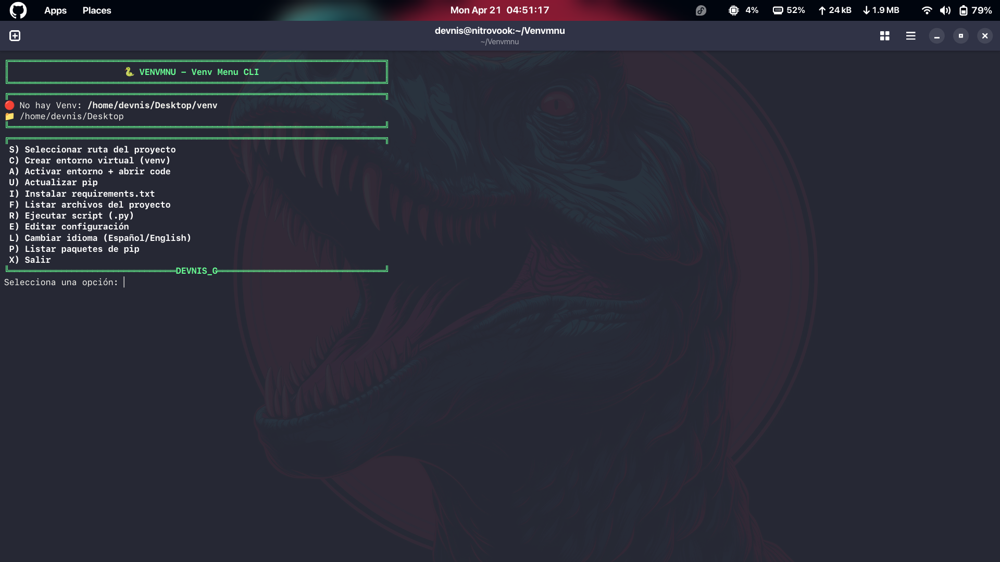
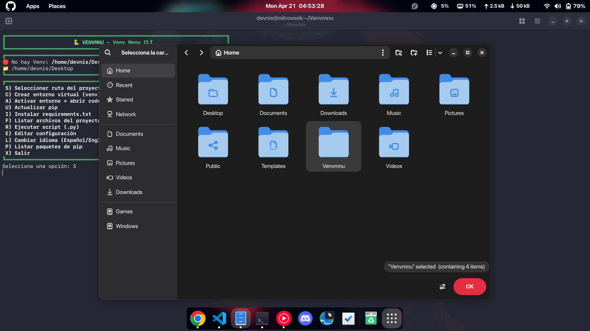
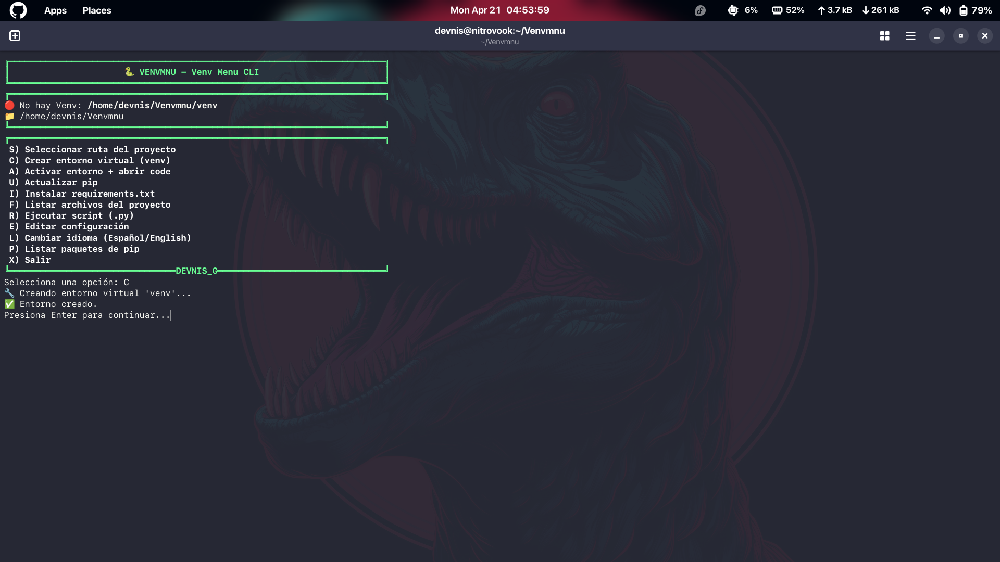
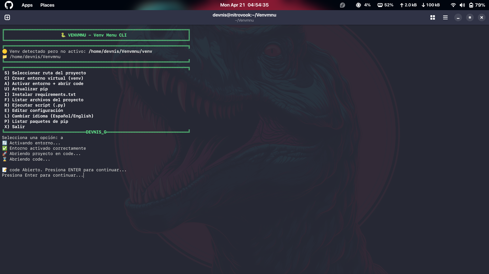
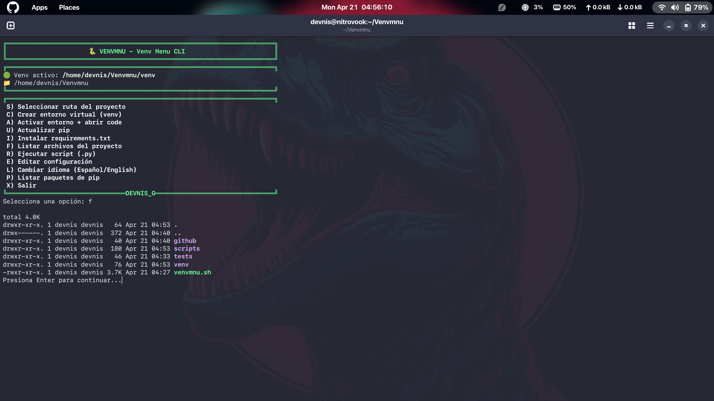
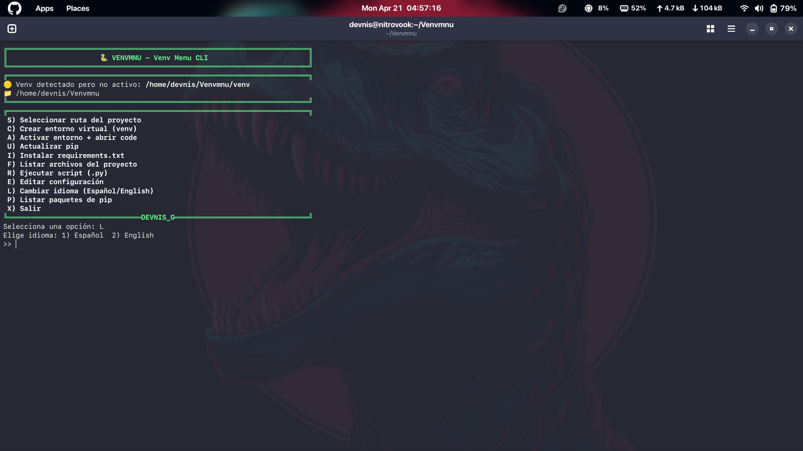
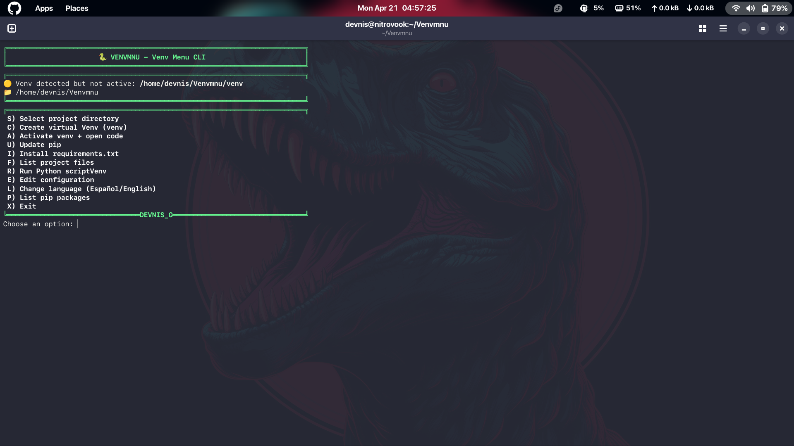

# 🐍 VENVMNU

**Menú para Entornos Virtuales en Python**

__Una herramienta CLI minimalista y personalizable para gestionar entornos virtuales de Python__

## 📦 Características:

- Crear, comprobar, activar y actualizar entornos virtuales (`venv`).
- Instalar dependencias desde `requirements.txt` automaticamente.
- Listar archivos del proyecto de manera sencilla.
- Ejecutar scripts Python con creación/activación automática de `venv`.
- Seleccionar ruta de proyecto con diálogo gráfico.
- Interfaz multilenguaje (Español / English).

## 🚀 Instalación:

1. **Clona el repositorio:**
```bash
   git clone https://github.com/DevnisG/Venvmnu.git
```

2. **Centrarse sobre el directorio del proyecto:** 
```bash
   cd Venvmnu
```

3. **Darle permisos al Setup y ejecutar el script:**
```bash
   chmod +x setup.sh
   ./setup.sh
```

4. **Ejecuta el Instalador:**
```bash
   setup.sh
```
5. **Seguir las instrucciones en la Terminal.**

## 🗑️ Desinstalacion:

1. **Centrarse sobre el directorio del proyecto:**
```bash
   cd Venvmnu
```

2. **Darle permisos al Uninstaller y ejecutar el script:**
```bash
   chmod +x uninstall.sh
   ./uninstall.sh
```

3. **Seguir las instrucciones en la Terminal.**

## ⚙️ Uso:

**Ejecuta el menú:**
```bash
vmnu
```
Sigue las opciones en pantalla.

## 🛠️ Configuración:

**Edita *"conf.cfg"* para cambiar:**

ENV_NAME="venv"               *Nombre del entorno virtual*
EDITOR="code"                 *Editor para abrir proyectos / config*
DEFAULT_SCRIPT="main.py"      *Script por defecto al ejecutar*
PROJECT_DIR="/ruta/proyecto"  *Ruta inicial*
LANG="es"                     *Idioma: 'es' o 'en'*


## 🫂 Contribuciones:

**¡Pull requests son bienvenidos! Abre un issue o envía PRs para nuevas funcionalidades.**

## ✉️ Contacto:

Este proyecto fue desarrollado por [Devnis](https://github.com/DevnisG).  
Si tienes **preguntas**, **sugerencias** o **comentarios**, no dudes en abrir un **Issue** o contactarme vía:

- **Correo electrónico**: <denis.gontero.2000@gmail.com>  
- **Discord**: *Devnis*  

## 📜 Licencia

VENMNU se distribuye bajo la **licencia MIT**. Consulta el archivo [LICENSE](LICENSE) para más detalles.  

¡Gracias por usar VENMNU Espero que te ayude a administrar tus entornos virtuales en Python de manera facil y eficiente.

## 🔍 Vista Previa

**Menu**
 

**SelectDir**
 

**CreateVenv**
 

**VenvActive**
 

**PipUpdate**
 

**ListFiles**
 

**SelectLanguage**
 

**Eng**
 
